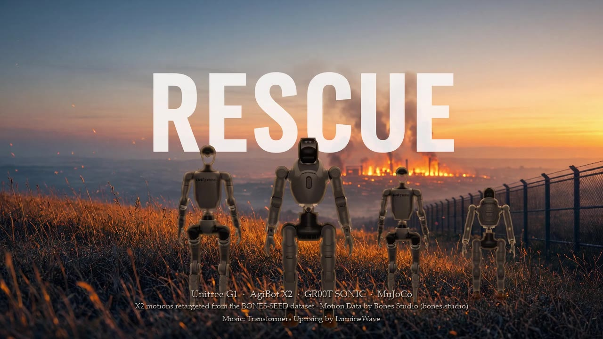
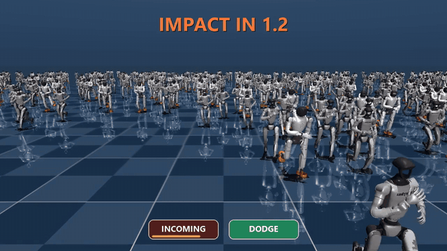
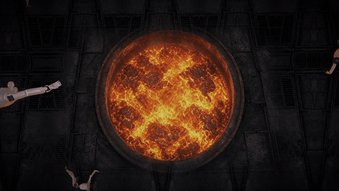
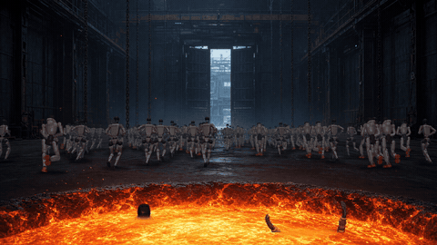
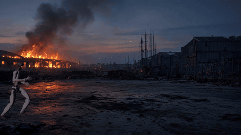
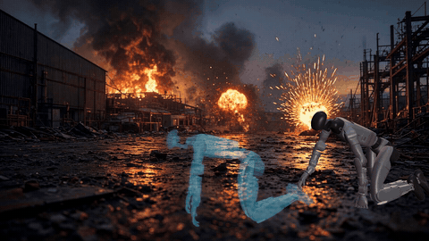
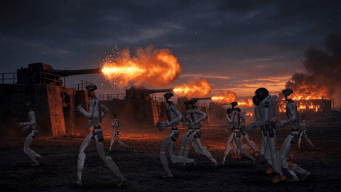
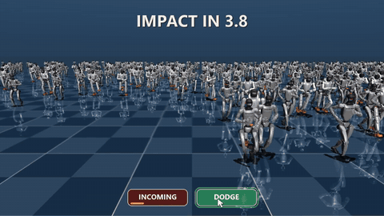

# 🤖 Rescue



> **Your mission, should you choose to accept it:** rescue the robots from decommissioning by
> training the ultimate motion control and planner models, and set them free.

**[▶ Watch the trailer](docs/media/rescue_trailer.mp4)** · **[Try it](#try-it)** · **[How it works](docs/HOW_IT_WORKS.md)**



## The trailer

Every robot below is simulated: Unitree G1s driven by NVIDIA GR00T SONIC, AgiBot X2s, MuJoCo physics.

| Into the pit | Run for the gates |
| :---: | :---: |
|  |  |
| **Duck the cannonball** · the ghost is the planner's target | **Crawl under fire** · kplanner crawl, SONIC physics |
|  |  |
| **Past the guns** | **DODGE** · robots replan out of the shells' path |
|  |  |

## In the game

| Duck (kinematic) | Duck (SONIC physics) | Walk to a ghost target |
| :---: | :---: | :---: |
|  |  |  |
| **Punch it away** | **Bat it away** | **No reaction: cannonball** |
|  |  |  |

## Try it

Windows, Python 3.12:

```powershell
git clone https://github.com/meetsitaram/robo-rescue
cd robo-rescue
py -3.12 -m pip install -r requirements.txt huggingface_hub

# NVIDIA GEAR-SONIC models (~860 MB), into ..\gear-sonic-g1
py -3.12 -c "from huggingface_hub import hf_hub_download as d; [d('nvidia/GEAR-SONIC', f, local_dir='../gear-sonic-g1') for f in ('planner_sonic.onnx', 'model_encoder.onnx', 'model_decoder.onnx')]"

.\run.ps1 -m rescue.app --mode game
```

More modes and keys: [How it works → Run](docs/HOW_IT_WORKS.md#run).

## Credits

Code: [Apache 2.0](LICENSE). G1 model: Unitree (BSD 3-Clause) via NVIDIA GR00T-WholeBodyControl.
SONIC planner and policy: [NVIDIA GEAR-SONIC](https://huggingface.co/nvidia/GEAR-SONIC) (downloaded,
not included). Trailer: X2 motions retargeted from the BONES-SEED dataset, Motion Data by
[Bones Studio](https://bones.studio/); music "Transformers Uprising" by LumineWave; backgrounds by
xAI Grok Imagine. Details: [THIRD_PARTY_NOTICES.md](THIRD_PARTY_NOTICES.md).
