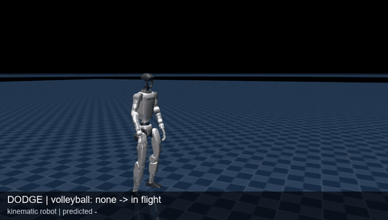
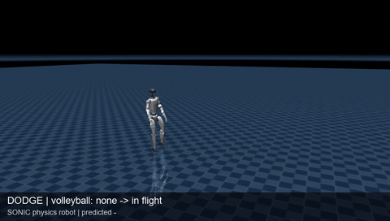
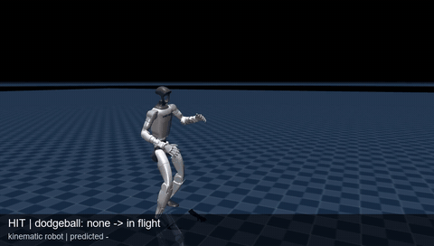
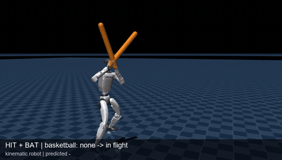
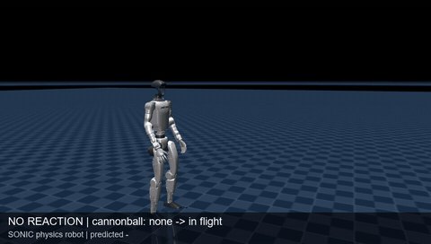
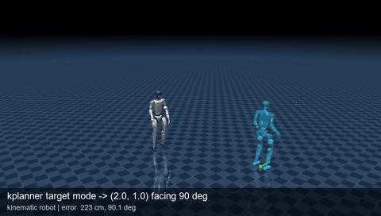
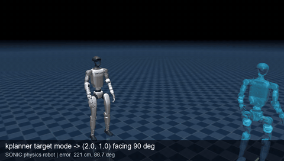

# Rescue

Hundreds of end-of-service humanoid robots are being decommissioned in a molten pit. Their only way
out is to climb out and run for the exit while the facility's defenses throw everything they have at
them. The player is a rescuer who unlocks the facility's main gates so the robots can escape, then
gets as many of them out as possible by improving their models, so they see what is coming and dodge
or deflect it. (Formerly FruitPunch.)

Phase 1, below, is the robot's survival pipeline in MuJoCo for the Unitree G1:

1. Track the ball in flight.
2. Predict where and when it will hit.
3. Pick a reaction and generate its motion with NVIDIA's GR00T SONIC **kinematic planner** (kplanner).
4. Check that motion against the predicted path before committing to it.

The robot then plays the motion directly as an animated character, or tracks it physically with the
SONIC whole-body policy.

| Crouch dodge (kinematic) | Crouch dodge (SONIC physics) |
| --- | --- |
|  |  |
| **Hit with a bare hand: aimed kplanner punch** | **Hit with a foam bat: aimed kplanner punch** |
|  |  |

| Cannonball, reactions off (SONIC physics) |
| --- |
|  |

With reactions switched off, a 5 kg cannonball launched from 25–40 m knocks the physical robot over.

Full-quality MP4s are in [`docs/media/`](docs/media). The phase 1 review page with seven longer
clips and per-throw tables is [`docs/preview/index.html`](docs/preview/index.html); open it locally
in a browser. Every problem hit along the way, with its fix, is in
[`docs/ISSUES.md`](docs/ISSUES.md).

## kplanner target-reach mode

The shipped `planner_sonic.onnx` can steer to a goal pose, not just follow velocity commands. NVIDIA's
deploy code never uses this: it always sends `has_specific_target = 0`. Rescue drives the planner
with a world-frame target position and heading. The planner generates whole-body walking or turning
toward the target, replanning every 0.4 s. The translucent ghost is the commanded pose.

| Kinematic robot | SONIC physics robot |
| --- | --- |
|  |  |
| Arrives within 1–2 cm and 3° | Arrives within 5–16 cm |

| Planner input | Shape | Use |
| --- | --- | --- |
| `context_mujoco_qpos` | 4 × 36 | Last 4 frames at 30 Hz: xyz, quaternion (wxyz), 29 joints |
| `mode` | 1 | 27 styles: idle, walk, run, squat, kneel, boxing, punches, hooks, crouch walk, … |
| `has_specific_target` | 1 | **1 = steer to the target below** |
| `specific_target_positions` | 4 × 3 | World xy goal (the last waypoint is used) |
| `specific_target_headings` | 4 | World yaw at the goal |
| `movement_direction`, `facing_direction`, `target_vel` | | Velocity-command mode (keyboard driving) |
| `height` | 1 | Squat and kneel height, 0.2–0.8 |
| output `mujoco_qpos` | ≤ 64 × 36 | Planned motion at 30 Hz, resampled to 50 Hz and blended over 8 frames |

On the physical robot, SONIC tracks relative motion and cannot slide its feet. Target following
therefore re-anchors the reference onto the robot. It also keeps the planner's goal at least 0.6 m
ahead, so the planner takes real steps, and holds in place once within 6 cm.

## Pipeline

1. **Throw:** a ball from the catalog below is launched at the robot, aimed between pelvis and chest.
2. **Track:** a parabola with known gravity is fitted to noisy observed positions (5 mm noise),
   refit every 0.1 s while the ball flies.
3. **Predict:** the arc is swept against the robot's planned future motion using MuJoCo's own
   collision check. The output is time to impact, contact point and body part.
4. **React:** candidate reactions are planned with the kplanner, each blended into the live motion
   and checked against the arc; the first that works is committed.
   - **DODGE:** stop, torso twist, forward lean, ducks (squat, one-leg kneel, kneel), turn and walk
     out, crouch-walk out, sidestep. Chest-high throws try ducks first; on SONIC, turn-and-walk comes
     before sidesteps.
   - **HIT:** a kplanner boxing guard facing the ball, then a kplanner punch or hook. The punch is
     timed by delaying the mode switch and aimed at full extension with arm IK. Fallback: an arm-IK
     swat.
5. **Execute:** kinematic mode plays the motion directly, with only the ball simulated. Physics
   mode tracks it with SONIC (encoder + decoder at 50 Hz, PD at 200 Hz).

Tomatoes stick to the torso and head (a weld switched on at contact); balls bounce.

| Ball | Diameter | Mass | Thrown from | Flight |
| --- | --- | --- | --- | --- |
| Tennis | 6.6 cm | 58 g | 3–5 m | 0.5–0.8 s |
| Dodgeball | 21 cm | 300 g | 4–6 m | 0.6–0.9 s |
| Volleyball | 21 cm | 270 g | 6–9 m, overhead | 1.1–1.5 s |
| Basketball | 24 cm | 620 g | 6–9 m, overhead | 1.1–1.5 s |
| Cannonball | 16 cm | 5 kg | 25–40 m | 2.6–3.4 s |
| Tomato, straight | 7 cm | 120 g | 8–10 m | 1.6–2.0 s, game-style floater at 8% gravity |
| Tomato, lob | 7 cm | 120 g | 6–8 m | 1.3–1.6 s |

## Results

28 throws per run, seed 0, balls drawn at random from the catalog. Success means avoided (DODGE) or
met by a hand or bat (HIT).

| Run | Success | Body hits | Other |
| --- | --- | --- | --- |
| No reaction (baseline) | 0 / 28 | 28 | |
| Kinematic · DODGE | 28 / 28 | 0 | 26 dodged, 2 missed anyway |
| Kinematic · HIT, bare hands | 19 / 28 | 4 | 5 bounced off an arm |
| Kinematic · HIT, foam bats | 20 / 28 | 4 | 2 bounced, 2 missed |
| SONIC physics · DODGE | 21 / 28 | 5 | 12 dodged, 9 missed anyway, 2 bounced; seed 1: 20 / 28 |
| SONIC physics · HIT, foam bats | 12 / 28 | 13 | 3 bounced; the robot fell 3 times and was reset |

Dodge reactions use the planner's shortest horizon (0.8 s) and 1.3× playback, so the robot reaches
its dodge pose sooner. On SONIC this cut the time for a duck from 0.94 s to 0.40 s and raised DODGE
from 19 to 20–21 avoided, with body hits down from 8 to 5–6. SONIC still trails its reference,
which matters most for big balls and close throws. The physics falls in these runs all came from
cannonball hits. Physics scores also vary from run to run
because multithreaded ONNX inference is not bit-exact.

## Setup

```powershell
py -3.12 -m pip install -r requirements.txt
```

The SONIC ONNX models (`planner_sonic.onnx`, `model_encoder.onnx`, `model_decoder.onnx`) come from
the Hugging Face repo [`nvidia/GEAR-SONIC`](https://huggingface.co/nvidia/GEAR-SONIC). By default
they are read from `../gear-sonic-g1/`; override this with `RESCUE_SONIC_DIR`.

## Run

```powershell
.\run.ps1 -m rescue.app --mode drive                                # keyboard driving
.\run.ps1 -m rescue.app --robot physics --mode target               # ghost target pose
.\run.ps1 -m rescue.app --mode game                                 # throws + dodging
.\run.ps1 -m rescue.app --mode game --objective hit --bat both      # hit them back
.\run.ps1 -m rescue.app --mode game --balls tennis,dodgeball        # pick the balls
.\run.ps1 scripts\headless_game.py --robot physics --objective dodge --throws 28
.\run.ps1 scripts\render_highlights.py                                  # regenerate docs/media
```

`--robot kinematic` (default) plays the planner's motion directly. `--robot physics` runs SONIC.

| Key | DRIVE | TARGET | GAME |
| --- | --- | --- | --- |
| Delete | next mode | next mode | next mode |
| Insert | throw a ball | throw a ball | throw a ball |
| Home | next gait | next gait | |
| Up / Down | walk forward / back | move ghost ±x 25 cm | |
| Left / Right | turn ±30° | move ghost ±y 25 cm | |
| PgUp / PgDn | strafe | rotate ghost ±30° | |
| End | squat on/off | ghost squat on/off | switch DODGE / HIT |
| Enter | | go to ghost | |

## Layout

| File | What |
| --- | --- |
| `rescue/g1.py` | G1 constants: joint maps, default pose, gains, planner modes |
| `rescue/planner.py` | `planner_sonic.onnx` wrapper, 30→50 Hz resampling, plan blending, replan policy, joint layers |
| `rescue/sonic.py` | SONIC encoder/decoder observation assembly (1762 / 994 dims) |
| `rescue/arena.py` | MuJoCo scene, kinematic vs physics robot, projectile shapes, sticky weld, foam bats |
| `rescue/runner.py` | 50 Hz tick, physics-mode target following |
| `rescue/projectile.py` | Launch solver, Euler-exact ballistic path, contact prediction |
| `rescue/balls.py` | Ball catalog |
| `rescue/game.py` | Thrower, trajectory tracker, DODGE and HIT selection, scoring, CSV log |
| `rescue/reach.py` | Arm IK for aimed punches and swats |
| `rescue/overlay.py` | Ghost robot, predicted arc, contact marker |
| `rescue/app.py` | Interactive viewer |
| `scripts/` | Smoke tests, headless games, clip and highlight renderers |
| `docs/` | Highlights, review page, issues log |

## Next

- Keep the robot walking around between and during throws.
- Punch timing on SONIC (HIT lands 12 of 28 on the physical robot).
- Kicks (the planner has no kick mode, so a leg layer like the arm aim is needed).
- AgiBot X2, then a browser or mobile build.

## License and credits

The code is licensed under the [Apache License 2.0](LICENSE); see [NOTICE](NOTICE).

- **Unitree G1 model** (`assets/g1`): from NVIDIA GR00T-WholeBodyControl (Apache-2.0), originally
  Unitree Robotics' unitree_ros, BSD 3-Clause ([`assets/g1/LICENSE`](assets/g1/LICENSE)).
- **GEAR-SONIC planner and policy**: not included. Download them from
  [`nvidia/GEAR-SONIC`](https://huggingface.co/nvidia/GEAR-SONIC); NVIDIA Open Model License.
- **Motion data**: none is included. Every motion is generated at runtime by the SONIC planner.
  Related work that uses BONES-SEED clips (Motion Data by [Bones Studio](https://bones.studio/),
  under the [BONES-SEED license](https://bones.studio/info/seed-license)) credits them where used.

Details for every third-party piece are in [THIRD_PARTY_NOTICES.md](THIRD_PARTY_NOTICES.md).
